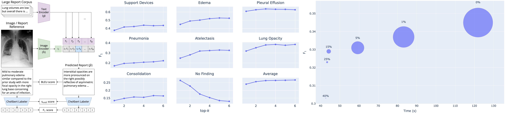

# CXR-RePaiR: Retrieval-Based Chest X-Ray Report Generation Using a Pre-trained Contrastive Language-Image Model

CXR-RePaiR (Contrastive X-ray-Report Pair Retrieval) is a retrieval-based radiology report generation approach that uses a contrastive language-image model.



## Running CXR-RePaiR

### Installation
#### Using conda

```
conda env create -f cxr-repair-env.yml
conda activate cxr-repair-env
```

### Data Preprocessing
In order to run our method, we must run a series of steps to process the MIMIC-CXR-JPG dataset.

#### Data Access

First, you must get approval for the use of [MIMIC-CXR](https://physionet.org/content/mimic-cxr/2.0.0/) and [MIMIC-CXR-JPG](https://physionet.org/content/mimic-cxr-jpg/2.0.0/). With approval, you will have access to the train/test reports and the jpg images.

#### Create Data Split
```
python data_preprocessing/split_mimic.py \
  --report_files_dir=<directory containing all reports> \
  --split_path=<path to split file in mimic-cxr-jpg> \
  --out_dir=mimic_data
```

#### Extract Impressions Section
```
python data_preprocessing/extract_impressions.py \
  --dir=mimic_data
```

#### Create Test Set of Report/CXR Pairs
```
python data_preprocessing/create_bootstrapped_testset_copy.py \
  --dir=mimic_data \
  --bootstrap_dir=bootstrap_test \
  --cxr_files_dir=<mimic-cxr-jpg directory containing chest X-rays>
```

#### Get groundtruth labels for test reports
Either retrieve chexpert embeddings of the mimic test reports provided in the mimic-cxr-2.0.0-chexpert.csv.gz file, or run CheXbert on the reports.csv file to get labels


### Pre-trained CLIP Model
The CLIP model checkpoint trained on MIMIC-CXR train set is available for download [here](https://stanfordmedicine.box.com/s/dbebk0jr5651dj8x1cu6b6kqyuuvz3ml).

### Generating embeddings for the corpus
```
python gen_corpus_embeddings.py \
  --clip_model_path=<name of clip model state dictionary for generating embeddings> \
  --data_path=<path of csv file containing training corpus (either sentence level or report level)> \
  --out=clip_pretrained_mimic_train_sentence_embeddings.pt
```

### Creating reports
```
python run_test.py \
  --corpus_embeddings_name=clip_pretrained_mimic_train_sentence_embeddings.pt \
  --clip_model_path=<name of clip model state dictionary> \
  --out_dir=CXR-RePaiR-2_mimic_results \
  --test_cxr_path=<path to test X-rays> \
  --topk=2
```

###  Generating labels of predicted reports
In order to generate per-pathology predictions from the outputted reports, use [CheXbert](https://github.com/stanfordmlgroup/CheXbert).

### Testing performance
```
python test_acc.py \
 --dir=CXR-RePaiR-2_mimic_results \
 --bootstrap_dir=<directory where boostrap indices and labels are stored> \
```

## License

This repository is made publicly available under the MIT License.


## Citing

If you are using this repo, please cite this paper:

```
@InProceedings{pmlr-v158-endo21a,
  title = 	 {Retrieval-Based Chest X-Ray Report Generation Using a Pre-trained Contrastive Language-Image Model},
  author =       {Endo, Mark and Krishnan, Rayan and Krishna, Viswesh and Ng, Andrew Y. and Rajpurkar, Pranav},
  booktitle = 	 {Proceedings of Machine Learning for Health},
  pages = 	 {209--219},
  year = 	 {2021},
  volume = 	 {158},
  series = 	 {Proceedings of Machine Learning Research}
}
```
